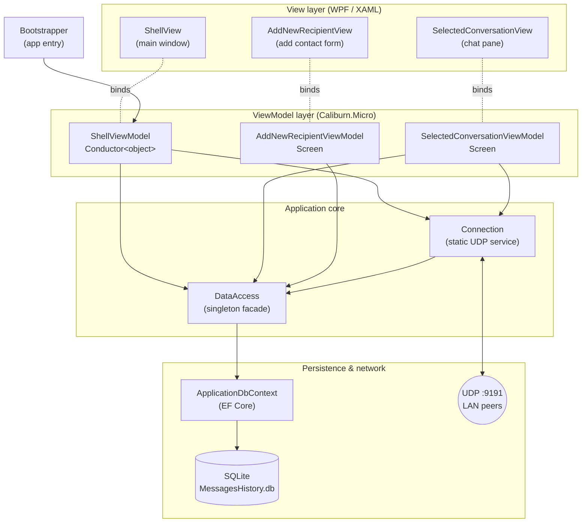
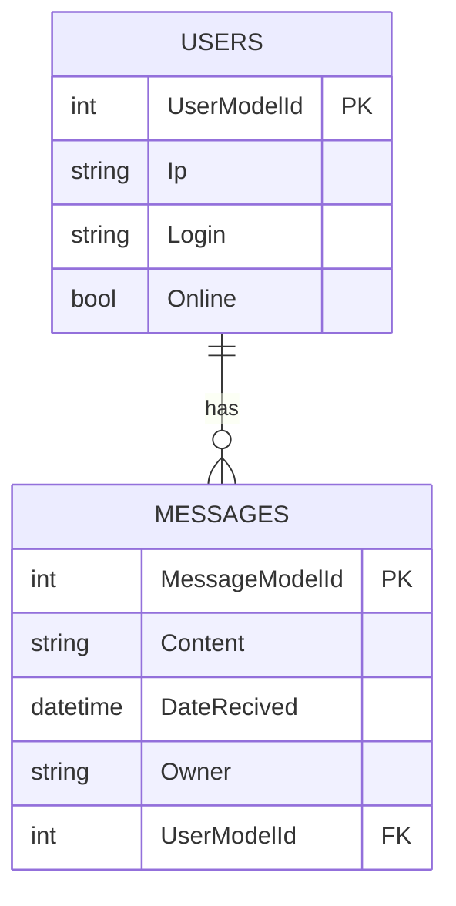

# Communicator — LAN Peer‑to‑Peer Messenger

> A Windows desktop instant‑messaging application that lets two or more computers on the
> same local network chat directly over **UDP**, with conversation history persisted locally
> in **SQLite**. Built with **C# / .NET 6 (WPF)** using the **MVVM** pattern.

<p>
  
  
  
  
  
  
  
  
</p>

> ℹ️ **Language note:** The user interface and several in‑code strings/comments are in **Polish**
> (`Komunikator` = *Messenger/Communicator*). A short glossary is included below so non‑Polish
> readers can follow the code. Class names, methods and the rest of the codebase are in English.

> ⚠️ **This project is a learning/prototype build.** Out of the box it will **not** run on a
> machine other than the original author's without a small code change — see
> [Quickstart → Important caveats](#-quickstart) before you build.

---

## Table of Contents

1. [Purpose](#-purpose)
2. [Main Features](#-main-features)
3. [Tech Stack](#-tech-stack)
4. [Architecture](#-architecture)
5. [Project Structure](#-project-structure)
6. [How It Works (Workflow)](#-how-it-works-workflow)
7. [Data Model](#-data-model)
8. [Quickstart](#-quickstart)
9. [Network Protocol Reference](#-network-protocol-reference)
10. [Known Limitations](#-known-limitations)
11. [Possible Improvements / Roadmap](#-possible-improvements--roadmap)
12. [Polish → English Glossary](#-polish--english-glossary)

---

## 🎯 Purpose

**Komunikator** is a desktop chat client for **direct, server‑less communication on a Local Area
Network (LAN)**. Instead of relying on a central messaging server, each running instance is both a
*client* and a *server*: it sends messages straight to another machine's IP address and
simultaneously listens for incoming messages on a fixed UDP port.

The application is a portfolio / educational project that demonstrates, in a single small codebase,
several distinct areas of desktop engineering:

- **Rich desktop UI** with WPF and a clean MVVM separation.
- **Low‑level network programming** — a hand‑written UDP messaging protocol with acknowledgements
  and (partial) online/offline presence.
- **Local relational persistence** with Entity Framework Core and SQLite, including a code‑first
  migration.

It is best understood as a **proof of concept for peer‑to‑peer LAN messaging**, not a
production‑ready product.

---

## ✨ Main Features

| Feature | Description | Where in code |
|---|---|---|
| **Add a contact by IP** | Register a peer by typing their IPv4 address and assigning them a local nickname (login). | `AddNewRecipientViewModel`, `DataAccess.AddNewUser` |
| **Contact / conversation list** | Left‑hand list of all known peers with quick actions (open chat / delete conversation). | `ShellView.xaml`, `ShellViewModel` |
| **Send messages over the LAN** | Messages are delivered directly to the peer as UDP datagrams on port `9191`. | `SelectedConversationViewModel.SendNewMessage`, `Connection.SendUdpPackage` |
| **Receive messages in the background** | A background listener continuously receives datagrams, auto‑registers unknown senders, and stores the message. | `Connection.StartListening` |
| **Delivery acknowledgement** | Every received chat message triggers a `RECIVED` [sic] acknowledgement back to the sender. | `Connection.StartListening` |
| **Persistent history** | Conversations and messages are saved to a local SQLite database and reloaded on startup. | `ApplicationDbContext`, `DataAccess` |
| **Delete a conversation** | Remove a peer and their message history from the store. | `ShellViewModel.DeleteUserConversation`, `DataAccess.DeleteUserConversation` |
| **Presence signalling** *(partial / dead code)* | ONLINE / OFFLINE broadcast helpers exist and an `Online` flag is modelled, but the broadcasters are never invoked and the flag is not shown in the UI. | `Connection.SendAvailabilitySignal`, `SendUnavailebilatySignal` |

---

## 🧰 Tech Stack

### Core platform
| Layer | Technology | Version | Role |
|---|---|---|---|
| Language | **C#** | 10 (implicit, .NET 6) | Application language |
| Runtime / TFM | **.NET** | `net6.0-windows` | Target framework (Windows‑only) |
| UI framework | **WPF** (Windows Presentation Foundation) | built‑in | Desktop GUI, XAML views |
| Output type | `WinExe` | — | Windows GUI executable |

### Libraries (NuGet)
| Package | Version | Purpose |
|---|---|---|
| **Caliburn.Micro** | 4.0.212 | MVVM framework: convention‑based view/viewmodel binding, `Conductor`/`Screen` lifecycle, event → action wiring |
| **Caliburn.Micro.Core** | 4.0.212 | Core MVVM primitives (`BindableCollection`, `PropertyChangedBase`) |
| **Microsoft.EntityFrameworkCore.Sqlite** | 7.0.2 | EF Core provider for SQLite |
| **Microsoft.EntityFrameworkCore.Relational** | 7.0.2 | Relational EF Core services |
| **Microsoft.EntityFrameworkCore.Tools** | 7.0.2 | Design‑time migrations tooling (`Add-Migration` / `Update-Database`) |

### Networking & persistence primitives
- **`System.Net.Sockets.UdpClient`** — connectionless UDP transport (send + async receive loop).
- **`System.Net.NetworkInformation` / `Dns`** — local IPv4 discovery and network‑availability checks.
- **SQLite** database file (`Database/MessagesHistory.db`) accessed via EF Core code‑first migrations.

### Tooling
- **Visual Studio 2022** solution (`Komunikator.sln`, format v17).
- Publish profiles for **ClickOnce** and **folder** deployment (`Properties/PublishProfiles`).

---

## 🏛 Architecture

The application follows the **Model‑View‑ViewModel (MVVM)** pattern, orchestrated by
**Caliburn.Micro**. Caliburn's *convention‑based binding* wires a `FooView` to a `FooViewModel`
and binds controls to properties/methods by matching `x:Name` — so there is very little
"glue" code in the views' code‑behind.



### Layer responsibilities

| Component | Type | Responsibility |
|---|---|---|
| `Bootstrapper` | `BootstrapperBase` | Caliburn.Micro entry point; displays `ShellViewModel` on startup. Declared as a resource in `App.xaml`. |
| `ShellViewModel` | `Conductor<object>` | Root screen. Owns the contact list, hosts the active child screen (`ActiveItem`), starts the UDP listener, opens/deletes conversations. |
| `SelectedConversationViewModel` | `Screen` | A single chat: holds the message list for one peer and sends new messages. |
| `AddNewRecipientViewModel` | `Screen` | Form to register a new peer (IP + login). |
| `DataAccess` | Singleton facade | The single gateway between UI state and storage. Wraps the `DbContext` and an in‑memory `BindableCollection<UserModel>` that the UI observes. |
| `ApplicationDbContext` | `DbContext` | EF Core mapping for `Users` and `Messages`; configures the SQLite connection and the one‑to‑many relationship. |
| `Connection` | static class | All networking: send datagram, background receive loop, acknowledgements, presence broadcast helpers, local‑IP discovery. |
| `Model/UserModel`, `Model/MessageModel` | POCO entities | Domain/persistence entities (a user/peer and a chat message). |

> **Design characteristic:** state is centralised in the `DataAccess` singleton's
> `BindableCollection<UserModel>`, which is shared by every ViewModel and also mutated by the
> background network thread in `Connection`. This keeps the code compact but couples everything to
> a global mutable object (see [Known Limitations](#-known-limitations) for the trade‑offs).

---

## 📁 Project Structure

```
Komunikator/
├─ Komunikator.sln                     # Visual Studio solution
└─ Komunikator/
   ├─ App.xaml / App.xaml.cs           # WPF application; declares the Bootstrapper resource
   ├─ Bootstrapper.cs                  # Caliburn.Micro startup → shows ShellViewModel
   ├─ AssemblyInfo.cs                  # WPF theme info
   │
   ├─ Connection.cs                    # UDP networking service (send/listen/ack/presence)
   ├─ DataAccess.cs                    # Singleton data-access facade over EF Core + BindableCollection
   ├─ ApplicationDbContext.cs          # EF Core DbContext (SQLite)
   │
   ├─ Model/
   │  ├─ UserModel.cs                  # Peer entity (Ip, Login, Online, Messages)
   │  └─ MessageModel.cs               # Message entity (Content, Owner, dates)
   │
   ├─ ViewModels/
   │  ├─ ShellViewModel.cs             # Root conductor (contact list + hosting)
   │  ├─ SelectedConversationViewModel.cs  # One conversation
   │  └─ AddNewRecipientViewModel.cs   # Add-contact form
   │
   ├─ Views/
   │  ├─ ShellView.xaml(.cs)           # Main window
   │  ├─ SelectedConversationView.xaml(.cs)  # Chat pane
   │  └─ AddNewRecipientView.xaml(.cs) # Add-contact form
   │
   ├─ Migrations/                      # EF Core code-first migration (initial schema)
   │  ├─ 20230120081423_initial.cs
   │  └─ ApplicationDbContextModelSnapshot.cs
   │
   ├─ Database/
   │  └─ MessagesHistory.db            # Committed SQLite file (see caveats)
   │
   └─ Properties/                      # launchSettings + ClickOnce/Folder publish profiles
```

> 🧹 **Repository hygiene note:** the repository also contains build output (`bin/`, `obj/`, the
> Visual Studio `.vs/` folder, hundreds of `*_wpftmp` temp files) and the `.db` file. These are
> generated artifacts that would normally be excluded with a `.gitignore`.

---

## 🔄 How It Works (Workflow)

### Startup
1. `App.xaml` instantiates the `Bootstrapper` (declared as an application resource).
2. `Bootstrapper.OnStartup` calls `DisplayRootViewForAsync<ShellViewModel>()`.
3. `ShellViewModel`'s constructor:
   - loads all known peers from the database via `DataAccess.getInstance().GetUserConversations()`,
   - activates an `AddNewRecipientViewModel` in the content area,
   - calls `Connection.StartListening()` to begin receiving datagrams in the background.

### Adding a contact
`AddNewRecipientView` (IP + login) → `AddNewUserConversation` → `DataAccess.AddNewUser` → inserts a
`UserModel` into both the in‑memory `BindableCollection` and the SQLite `Users` table. Duplicate IPs
are rejected with a message box.

### Sending a message

```mermaid
sequenceDiagram
    autonumber
    actor U as User A
    participant VM as SelectedConversationViewModel
    participant C as Connection (static)
    participant DA as DataAccess
    participant DB as SQLite
    participant B as User B (remote)

    U->>VM: type text, click "Wyślij wiadomość"
    VM->>C: SendUdpPackage(peer, text)
    C->>C: build "localIP;9191;text" (ASCII)
    C-->>B: UDP datagram → peerIP:9191
    alt IP valid
        C-->>VM: true
        VM->>DA: AddNewMessage(peerIP, text, "ja")
        DA->>DB: INSERT message (SaveChanges)
        VM->>VM: add message to bound list (UI updates)
    else IP invalid (FormatException)
        C-->>VM: false
        VM->>U: MessageBox "Nieprawidłowy adres IP"
    end
```

### Receiving a message
`Connection.StartListening()` runs an infinite `await udpClient.ReceiveAsync()` loop on a background
task. For each datagram it splits the payload on `;` into `senderIP ; senderPort ; content` and then:

- **Chat message** (content ≠ `RECIVED`/`ONLINE`/`OFFLINE`): send a `RECIVED` acknowledgement back,
  auto‑register the sender (`AddNewUser`, default login *"Nieznany"* = *Unknown* if new), and persist
  the message with the sender's login as owner.
- **`ONLINE` / `RECIVED`**: mark the sender online (`SetUserOnline`).
- **`OFFLINE`**: mark the sender offline (`SetUserOffline`).

> The online/offline path is only reachable via the `RECIVED` acks, because the dedicated
> `SendAvailabilitySignal` / `SendUnavailebilatySignal` broadcasters are **never called** anywhere in
> the app. Presence is therefore effectively unfinished.

---

## 🗃 Data Model

Two tables, one‑to‑many (`User` 1—* `Message`), created by the `initial` migration.



| Entity | Field | Notes |
|---|---|---|
| `UserModel` | `Ip`, `Login`, `Online`, `Messages` | `Online` is modelled but not persisted‑meaningful in the UI. |
| `MessageModel` | `Content`, `Owner`, `DateSend`, `DateRecived` | ⚠️ `DateSend` is **get‑only** (set in the constructor) so EF ignores it — it is **not** in the mapped schema. `DateRecived` **is** mapped but is never assigned in code, so it stays at `default(DateTime)`. Neither timestamp is shown in the UI. |

> The connection string in `ApplicationDbContext.OnConfiguring` points at a **hardcoded absolute path**
> and the app never calls `Database.Migrate()`/`EnsureCreated()`. See the caveats below.

---

## 🚀 Quickstart

### Prerequisites
- **Windows** (the target framework is `net6.0-windows`; WPF is Windows‑only).
- **.NET 6 SDK**.
- **Visual Studio 2022** (with the *.NET desktop development* workload) — recommended — or the
  `dotnet` CLI plus `dotnet-ef` for migrations.
- Two machines (or two firewall‑permitted processes) on the **same LAN** to actually exchange messages.

### ⚠️ Important caveats (read before building)
This project **does not run on a fresh checkout as‑is**. Two things must be fixed first:

1. **Hardcoded database path.** `ApplicationDbContext.OnConfiguring` contains:
   ```csharp
   optionsBuilder.UseSqlite(@"Data Source=C:\Users\USER\source\repos\Komunikator\Komunikator\Database\MessagesHistory.db");
   ```
   That absolute path only exists on the original author's machine. **Replace it** with a portable
   path, e.g.:
   ```csharp
   optionsBuilder.UseSqlite("Data Source=Database/MessagesHistory.db");
   // or, more robustly, under %LOCALAPPDATA%\Komunikator\MessagesHistory.db
   ```
2. **Schema creation.** The app never creates the schema at runtime. On a new machine you must
   materialise the database once, either by running the migration:
   ```bash
   dotnet tool install --global dotnet-ef        # if not already installed
   dotnet ef database update --project Komunikator/Komunikator.csproj
   ```
   or by adding `_dbContext.Database.Migrate();` in `DataAccess`'s constructor.

### Build & run
```bash
# from the repository root
dotnet build Komunikator.sln -c Debug
dotnet run --project Komunikator/Komunikator.csproj
```
…or open `Komunikator.sln` in Visual Studio and press **F5**.

### Try it across two machines
1. On each PC, find its LAN IPv4 (`ipconfig`).
2. Allow inbound **UDP port 9191** through Windows Firewall on both machines.
3. On PC‑A, *Dodaj nowego odbiorcę* (Add new recipient) → enter **PC‑B's IP** + a nickname.
4. Open the chat and send a message; it should appear on PC‑B (which auto‑registers PC‑A).

> Because messages are encoded as **ASCII**, non‑ASCII characters (including Polish diacritics such
> as ą, ł, ż) will be corrupted in transit. Use plain ASCII text when testing.

---

## 📡 Network Protocol Reference

A minimal, text‑based, connectionless protocol over UDP.

| Property | Value |
|---|---|
| Transport | UDP (`UdpClient`) |
| Port | `9191` (fixed, hardcoded) |
| Encoding | ASCII |
| Datagram format | `senderIP;senderPort;content` (semicolon‑delimited) |

| `content` value | Meaning | Receiver behaviour |
|---|---|---|
| *(any other text)* | Chat message | Store it, reply with `RECIVED` |
| `RECIVED` [sic] | Delivery acknowledgement | Mark sender online |
| `ONLINE` | Presence: available | Mark sender online |
| `OFFLINE` | Presence: unavailable | Mark sender offline |

> **Caveats:** the `senderIP`/`senderPort` are taken from the *payload*, not the real socket source
> (trivially spoofable); a message body containing `;` breaks parsing; malformed datagrams throw and
> silently kill the receive loop.

---

## 🚧 Known Limitations

- **Not portable** — hardcoded absolute DB path; no runtime schema bootstrap.
- **Thread safety** — the EF `DbContext` and the UI `BindableCollection` are mutated from the
  background UDP thread; WPF cross‑thread and EF concurrency hazards.
- **Fragile parser** — malformed/spoofed datagrams crash the (un‑guarded) receive loop.
- **ASCII only** — corrupts the app's own Polish UI language in message bodies.
- **No security** — plaintext, no auth, spoofable sender identity.
- **Unfinished features & dead code** — presence broadcasters never called; `owner` label bound to a
  mis‑cased property; message timestamps never populated; commented‑out blocks.
- **No tests, no dependency injection, no `.gitignore`.**

---

## 🧭 Possible Improvements / Roadmap

- Make the DB path relative / configurable and call `Database.Migrate()` on startup.
- Marshal all UI/collection updates back to the UI thread (`Dispatcher`) and give the network layer
  its own short‑lived `DbContext` per operation (or a thread‑safe repository).
- Wrap the receive loop in `try/catch`, validate packet shape, and use length‑prefixed or JSON
  framing instead of `;`‑splitting; switch to UTF‑8.
- Introduce dependency injection (Caliburn.Micro's `SimpleContainer`) instead of the `DataAccess`
  singleton and `static Connection`.
- Implement `INotifyPropertyChanged` on the models so state changes propagate without the
  remove‑then‑add refresh hack.
- Add unit/integration tests, a `.gitignore`, a LICENSE, and CI.
- Add authentication/encryption and real presence heartbeats.

---

## 📖 Polish → English Glossary

| Polish (in code / UI) | English |
|---|---|
| Komunikator | Messenger / Communicator |
| Dodaj nowego odbiorcę | Add new recipient |
| Otwórz chat | Open chat |
| Usuń konwersację | Delete conversation |
| Wyślij wiadomość | Send message |
| Podaj adres IP urządzenia docelowego | Enter the target device's IP address |
| Podaj login jaki chcesz nadać użytkownikowi | Enter the login you want to give the user |
| Nieprawidłowy adres IP | Invalid IP address |
| Użytkownik o podanym IP już istnieje! | A user with the given IP already exists! |
| Udało się usunąć konwersacje | Conversation deleted successfully |
| Nie udało się usunąć konwersacji | Failed to delete the conversation |
| Nieznany | Unknown (default login for auto‑registered peers) |
| ja | me (owner tag for locally sent messages) |
| `RECIVED` / `Unavailebilaty` | misspellings of *Received* / *Unavailability* in the code |
